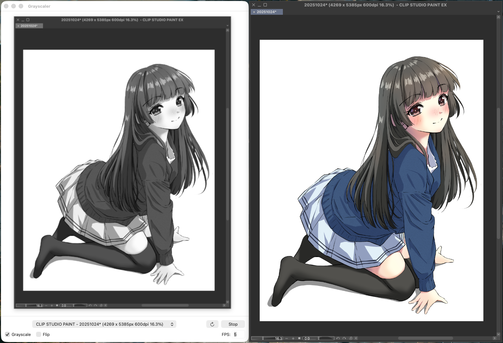

# Grayscaler for Mac

他のウィンドウの画面をキャプチャし、グレースケール化して表示する macOS アプリケーションです。

イラスト制作時の色彩バランス確認や、デザインのコントラストチェックなどに活用できます。

## 機能

- **リアルタイムキャプチャ** - 選択したウィンドウをリアルタイムで表示
- **グレースケール変換** - ON/OFF 切り替え可能（デフォルト: ON）
- **左右反転（Flip）** - ON/OFF 切り替え可能（デフォルト: OFF）
- **FPS 設定** - キャプチャ頻度を調整可能（デフォルト: 5fps）
- **アスペクト比維持** - 元画像の比率を保ったまま表示

## スクリーンショット

使用例: CLIP STUDIO PAINT で編集中の作品のカラーバランスを Glayscaler でリアルタイムに確認する

※ 編集画面とは別に、CLIP STUDIO PAINT メニューの `ウィンドウ` - `キャンバス` - `新規ウィンドウ` でウィンドウを増やしてそちらをキャプチャすると使いやすいです。



右側は CLIP STUDIO PAINT の元ウィンドウ。
左側は Glayscaler でグレースケール化。

元ウィンドウの画像に変更が加えられると Glayscaler 側にもリアルタイムで反映されます。
両方を同時に確認しながらのカラーバランス調整がしやすいです。


グレースケール化＋左右反転。
元々 CLIP STUIDO PAINT では左右反転画面を同時に確認できるので不要ですが、Photoshop などを使用する場合は便利だと思います。

## 動作環境

- macOS 14.0 以降
- 画面収録の権限が必要です

## ビルド方法

```bash
# ビルド
swift build

# 実行
.build/debug/Grayscaler
```

リリースビルド:

```bash
swift build -c release
.build/release/Grayscaler
```

## 使い方

1. アプリを起動します
2. 初回起動時に「画面収録」の権限を求められるので、システム設定で許可してください
3. プルダウンメニューからキャプチャしたいウィンドウを選択します
4. 「Start」ボタンをクリックするとキャプチャが開始されます
5. 必要に応じて Grayscale / Flip を切り替えたり、FPS を調整してください
6. 「Stop」ボタンでキャプチャを停止できます

## 権限設定

このアプリは画面収録の権限が必要です。

システム設定 > プライバシーとセキュリティ > 画面収録 で Grayscaler を許可してください。

権限をリセットする場合:

```bash
tccutil reset ScreenCapture
```

## ライセンス

Apache License 2.0
